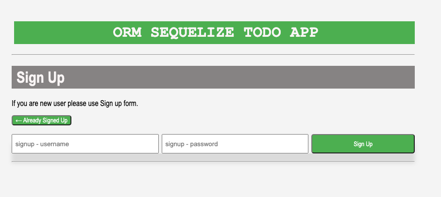

# ORM-Sequelize-Todo

This is a fully functional CRUD (Create, Read, Update, Delete) Todo application where you can manage users and their associated todos. The application utilizes Sequelize as the ORM, MySQL as the database, dotenv for environment variable management, and is built using Express and Node.js.

## Features

- Create, Read, users
- Create, Read, and Delete todos
- Association between users and todos using foreign keys
- Utilizes Sequelize for Object-Relational Mapping (ORM)
- Uses MySQL as the database
- Manages environment variables with dotenv
- Built with Express and Node.js

## Screenshots:
### Figure 1. Home



## Getting Started

1. Clone the repository:

   ```bash
   git clone https://github.com/sonam-git/ORM-Sequelize-Todo.git
   
2. open your terminal and run npm i 
3. set up your enviromental variable creating .env file in the rootfolder


## Deployed Application Link:
[Deployed Application Link:]( https://orm-sequelize-todo-app-81c0aab11b39.herokuapp.com/)

## GitHub Repository:
[GitHub Repository:](https://github.com/sonam-git/ORM-Sequelize-Todo)


  ## Built With:
- JSON:[ JSON](https://www.npmjs.com/package/json)
- Dynamic JavaScript
- Node.js [Version 16.18.1](https://nodejs.org/en/blog/release/v16.18.1/)
- Express.js:[Express.js](https://expressjs.com/en/starter/installing.html)
- Bcryptjs: [2.4.3](https://www.npmjs.com/package/bcryptjs)
- Connect Session Store using Sequelize: [7.0.4](https://www.npmjs.com/package/connect-session-sequelize)
- Dotenv: [8.6.0](https://www.npmjs.com/package/dotenv)
- Express: [4.17.1](https://www.npmjs.com/package/express)
- Express Handlebars: [5.2.0](https://www.npmjs.com/package/express-handlebars)
- Express-Session: [1.17.1](https://www.npmjs.com/package/express-session)
- Handlebars.js: [4.7.6](https://www.npmjs.com/package/handlebars)
- Node MySql2: [2.3.3](https://www.npmjs.com/package/mysql2)
- Sequelize: [6.29.3](https://www.npmjs.com/package/sequelize)
- Postman: [Postman](https://www.postman.com/)
- Luxon: [Luxon](https://moment.github.io/luxon/)
- License Badge: [Shields.io](https://shields.io/)
- Visual Studio Code: [Website](https://code.visualstudio.com/)

## What I Learned:
1. Implementing Model-View-Controller (MVC) architecture.
2. Creating and interacting with a MySQL database using Sequelize ORM.
3. Creating and using Express.js servers and routes / API endpoint.
4. Using Handlebars.js to create and display dynamic templates.
5. Implementing user authentication and password hashing with bcrypt.
6. Apply css for styling, 

### Continued Development:
1. Pagination for todos.
2. Editing and todos.
3. User profile pages.
4. Deleting/ Updating users

## License
This project is covered under the [MIT](https://opensource.org/licenses/MIT) license.

## Author
Follow me on Github at [Sonam J Sherpa](https://github.com/sonam-git).
Additional questions or concerns? feel free to contact me at sherpa.sjs@gmail.com